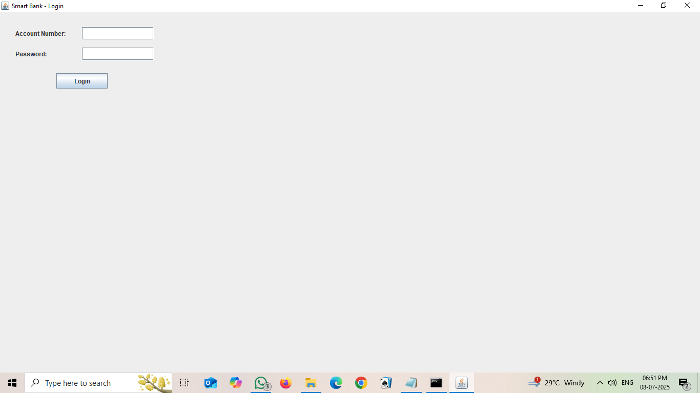

##🏦 Bank Management System using Java Swing

This is a desktop-based Bank Management System project built using **Java Swing** and **file handling**.  
It allows users to create bank accounts, login securely, and perform common banking tasks without a database.
---

##🚀 Features

🧾 Create New Bank Account
🔐 Login with Account Number & Password
💰 Deposit Money
💸 Withdraw Money
👀 Check Current Balance
🔁 Logout
---

##🛠 Technologies Used

Java SE
Java Swing (GUI)
File Handling in Java (no database used)

---

##📁 Folder Structure
SmartBankSwing/ ├── LoginPage.java 
                ├── CreateAccountPage.java 
                ├── MainMenuPage.java 
                ├── DepositPage.java 
                ├── WithdrawPage.java
                ├── accounts.dat   ← Data file created after registration 
                ├── README.md

---

##📌 How to Run

1. Open Command Prompt 
2. Go to project folder:cd Desktop\SmartBankSwing
3. Compile all files:javac *.java
4. Run the application:java LoginPage

✅ Now you can create accounts and log in to perform banking actions via the GUI.

---

##✅ Project Status
🎯 Project Completed

✅ All modules tested: Create, Login, Deposit, Withdraw, Balance check
📁 Uses file accounts.dat to store user data

---

##💡 Future Enhancements

Add account deletion option
Use a real database like MySQL
Encrypt passwords
Show transaction history
GUI balance summary on login

---

## 🖼 screenshots

### 🔐 Login Page

### 📝 Create Account

### 🧭 Main Menu

### 💰 Deposit

### ✅ Deposit Success

### 💸 Withdraw

### ✅ Withdraw Success

### 📊 Balance Check

